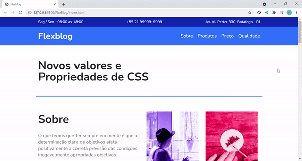
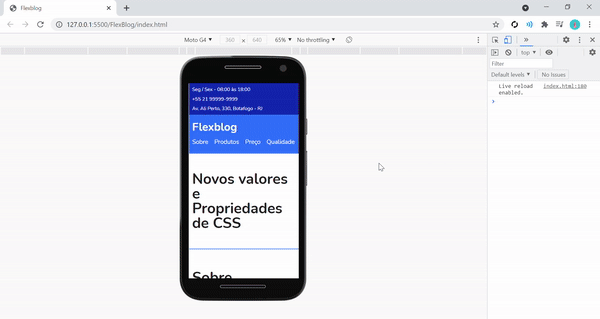
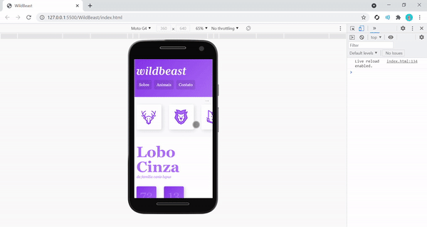

# OrigamidCursos
Repositório reservado para arquivar todo o conhecimento adquirido durante os cursos da Origamid. Cursos a respeito de todo front end, desde HTML básico até tecnologias mais recentes como React e Vue.  
Lista de cursos que irá ter neste repositório:
- [X] CSS Flexbox
- [X] CSS Grid Layout.
- [ ] CSS Posicionamento Avançado
- [ ] CSS com SASS
- [ ] Bootstrap 4
- [ ] Javascript e Jquery
- [ ] Javascript Completo ES6
- [ ] React
- [ ] Redux Com React 
- [ ] Automação Front End com NPM
- [ ] Vue.js 2

 

# FlexBlog
FlexBlog é um projeto de estudo que tem por finalidade aprimorar o conhecimento a respeito do __flexbox__ dentro do css, utilizando e vendo conceitos de todos as propriedades de um flex container e de um flex item. É desenvolvido tanto a parte desktop quanto a mobile com flexbox.
 
 
 

    <h3 align=center>FlexBlog versão desktop:</h3>
    

        
    

 

    <h3 align=center>FlexBlog versão mobile:</h3>
    

        
    
  

 

# WildBeast
WildBeast é um projeto que tem por propósito o estudo e o aprimoramento de técnicas utilizando __Grid Layout__ como forma de organizar o site. No curso é abordado tanto a parte desktop quanto a mobile com o sistema de grid layout.
 
 
 

    <h3 align=center>WildBeast versão desktop:</h3>
    

        
    

 

    <h3 align=center>WildBeast versão mobile:</h3>
    

        
    
  

